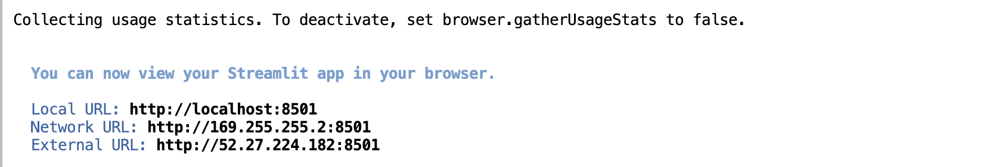
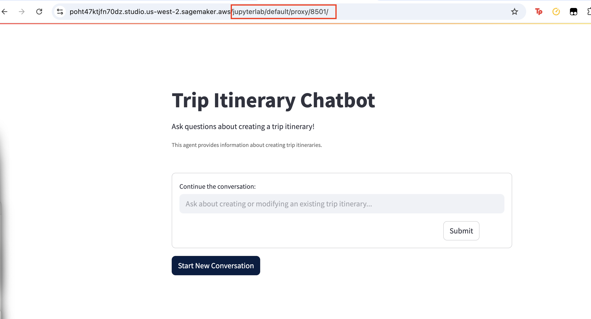
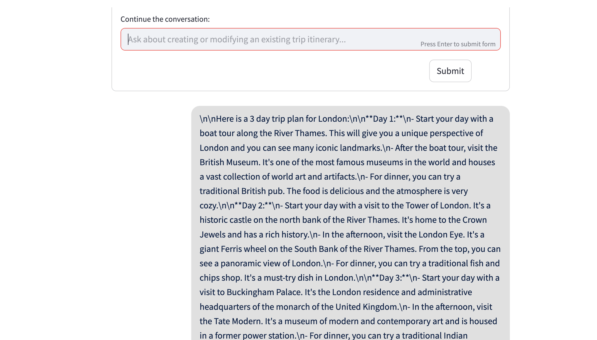

# Deploying a `LangGraph` Agent with `FastAPI`, AWS `Lambda`, and `Streamlit`

## Introduction to FastAPI
`FastAPI` is a modern, high-performance web framework for building APIs with Python. It's designed to be easy to use while offering automatic API documentation, data validation, and serialization capabilities.

In the context of this lab, `FastAPI` provides a convenient way to create an API wrapper around the `LangGraph` agent, making it accessible via HTTP requests.

## Deployment Architecture

The deployment architecture consists of three main components:
### 1. LangGraph Agent with FastAPI Interface

The core of the system is a `FastAPI` application that wraps the `LangGraph` agent. This application exposes endpoints that clients can use to interact with the agent, particularly the `/generate-itinerary` endpoint that receives user messages and returns itinerary information.

### 2. AWS `Lambda` and `API Gateway` Deployment
The `FastAPI` application is containerized and deployed as an AWS `Lambda` function with `API Gateway` integration. This serverless approach allows the system to scale automatically based on demand.

### The deployment process includes:

- Building and pushing a Docker container to Amazon Elastic Container Registry (ECR)
- Creating a Lambda function using the container image
- Setting up API Gateway with Lambda integration
- Configuring API key authentication for security

### 3. Streamlit User Interface
The final component is a `Streamlit` application that provides a user-friendly interface for interacting with the agent. 


## SageMaker Studio Deployment Instructions

### Prerequisites

1. Access to an AWS account with SageMaker Studio enabled

2. Appropriate IAM permissions for Amazon Bedrock, ECR, Lambda, and API Gateway

3. To run the solution from `SageMaker` studio, push the image to docker first locally or from somewhere out of the `SageMaker` studio environment. The command will create an image and push it to your ECR repository (that will also be created once you run this command). You will have to re-clone the GitHub repository and create the python `uv venv` from where you are running these commands: 

    ```bash
    # Navigate to your project directory
    cd Build-agents-with-LangGraph
    python deploy.py --build-only
    ```

4. Open `SageMaker` studio and run the following command to create the lambda function, containerize it and then make it available via `API Gateway`:

    ```bash
    python deploy.py --image-uri <account-id>.dkr.ecr.<region>.amazonaws.com/trip-itinerary-assistant:latest --function-name lambda-fn-deploy --role-arn <lambda-role-arn> --region <region> --api-gateway
    ```

    - This will produce an output like below:

    ```bash
    Successfully deployed Lambda function: lambda-fn-deploy
    Function ARN: arn:aws:lambda:us-west-2:218208277580:function:lambda-fn-deploy
    ================================================================================
    Deploying API Gateway (lambda-fn-deploy-api) for Lambda function: lambda-fn-deploy
    ================================================================================
    Created new API Gateway: jays500raa
    Created API key: zz4bxxsrqj
    Created new Lambda integration: wop7b8l
    Created route: GET /
    Created route: GET /docs
    Created route: GET /{proxy+}
    Created route: POST /{proxy+}
    Added permission for API Gateway to invoke Lambda
    Created stage: prod
    Created usage plan: tttz6b
    Error associating stage with usage plan: An error occurred (BadRequestException) when calling the UpdateUsagePlan operation: Usage plans are not allowed for HTTP Apis
    Associated API key with usage plan

    ================================================================================
    API Gateway successfully deployed!
    API URL: https://jays500raa.execute-api.us-west-2.amazonaws.com/prod
    API Key: b8e4b2a3-a242-4fde-838d-851051488fbf

    To use this API with the key:
    curl -H 'x-api-key: b8e4b2a3-a242-4fde-838d-851051488fbf' https://jays500raa.execute-api.us-west-2.amazonaws.com/prod

    For the /docs endpoint (Swagger UI):
    https://jays500raa.execute-api.us-west-2.amazonaws.com/prod/docs
    ================================================================================
    Lambda deployment process completed.
    ```

5. Launch the `streamlit` application: 

    ```bash
    streamlit run chatbot.py -- --api-server-url https://<API_ID>.execute-api.<REGION>.amazonaws.com/prod/generate-itinerary --api-key <API_KEY>
    ```

6. Test your agent deployed locally: 

    ```bash
    curl -X POST -H "Content-Type: application/json" -H "x-api-key: <API_KEY>" -d '{"user_message":"Plan a trip to Paris"}' https://<API_ID>.execute-api.<REGION>.amazonaws.com/prod/generate-itinerary
    ```

7. **Access the Streamlit UI through the SageMaker proxy**: The terminal will show URLs, including an "External URL" which you can use to access the `Streamlit` interface. Create a `SageMaker` proxy URL by taking your `SageMaker` domain URL and adding: `/jupyterlab/default/proxy/8501/` at the end as given below and open the link to view the `streamlit` application:








## Steps to run it locally/through EC2:

1. Make sure you have the virtual environment activated. Run the command below to deploy the agent. This command runs the `build_and_push.sh` script to build the docker image and push it to `Amazon Elastic Container Registry (ECR)`. Next, it creates a new Lambda function using the container image. It also creates an HTTP API (API Gateway v2) to invoke the Lambda function. The API Gateway URL is printed at the end of the script. This command also creates an API key for securing the API with a usage plan.

    ```bash
    python deploy.py --function-name <name-of-your-lambda-function> --role-arn <your-iam-role-name> --api-gateway
    ```

    The IAM role you need to use for the AWS Lambda needs to have Amazon Bedrock access (for example via [AmazonBedrockFullAccess](https://docs.aws.amazon.com/aws-managed-policy/latest/reference/AmazonBedrockFullAccess.html)) to use the models available via Amazon Bedrock and the models need to be enabled within your AWS account, see instructions available [here](https://docs.aws.amazon.com/bedrock/latest/userguide/model-access.html).

2. You can test the API using `curl` or `Postman`. The API Gateway URL is printed at the end of the script. You can use this URL to test the API. The API key is also printed at the end of the script. You can use this API key to test the API.

    ```bash
    curl -X POST -H "Content-Type: application/json" -d '{"user_message":"Plan a trip to Paris"}' https://<YOUR-API-KEY>.execute-api.us-east-1.amazonaws.com/prod/generate-itinerary
    ```

3. **Launch the streamlit app**: Run the command below to launch the streamlit app. This app will use the API Gateway URL to generate a response using the agent. The app will also show the response generated by the LangGraph agent.

    ```bash
    streamlit run chatbot.py -- --api-server-url https://<YOUR-API-KEY>.execute-api.us-east-1.amazonaws.com/prod/generate-itinerary
    ```