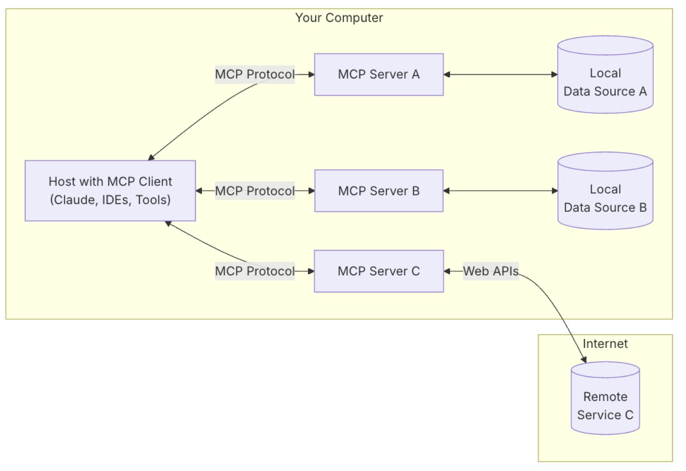

# Use Model Context Protocol with `LangGraph` and `Amazon Bedrock`

AI agents extend large language models (LLMs) by interacting with external systems, executing complex workflows, and maintaining contextual awareness across operations. Amazon Bedrock Agents enables this functionality by orchestrating foundation models (FMs) with data sources, applications, and user inputs to complete goal-oriented tasks through API integration and knowledge base augmentation. However, in the past, connecting these agents to diverse enterprise systems has created development bottlenecks, with each integration requiring custom code and ongoing maintenance—a standardization challenge that slows the delivery of contextual AI assistance across an organization’s digital ecosystem. This is a problem that you can solve by using Model Context Protocol (MCP), which provides a standardized way for LLMs to connect to data sources and tools.

## What is Model Context Protocol?

Developed by Anthropic as an open protocol, MCP provides a standardized way to connect AI models to virtually any data source or tool. Using a client-server architecture, MCP enables developers to expose their data through lightweight MCP servers while building AI applications as MCP clients that connect to these servers. Through this architecture, MCP enables users to build more powerful, context-aware AI agents that can seamlessly access the information and tools they need. Whether you’re connecting to external systems or internal data stores or tools, you can now use MCP to interface with all of them in the same way. The client-server architecture of MCP enables your agent to access new capabilities as the MCP server updates without requiring any changes to the application code.

## MCP architecture

MCP uses a client-server architecture that contains the following components and is shown in the following figure:

- **Host**: An MCP host is a program or AI tool that requires access to data through the MCP protocol, such as Claude Desktop, an integrated development environment (IDE), or any other AI application.

- **Client**: Protocol clients that maintain one-to-one connections with servers.

- **Server**: Lightweight programs that expose capabilities through standardized MCP.

- **Local data sources**: Your databases, local data sources, and services that MCP servers can securely access.

- **Remote services**: External systems available over the internet through APIs that MCP servers can connect to.



1. how to set up Amazon Bedrock agents that take advantage of MCP servers:

```python
InlineAgent(
    foundation_model="us.anthropic.claude-3-5-sonnet-20241022-v2:0",
    instruction="You are a friendly assistant for resolving user queries",
    agent_name="SampleAgent",
    action_groups=[
        ActionGroup(
            name="SampleActionGroup",
            mcp_clients=[mcp_client_1, mcp_client_2],
        )
    ],
).invoke(input_text=”Convert 11am from NYC time to London time”)
```

View the entire implementation and code in [this blog](https://aws-preview.aka.amazon.com/blogs/machine-learning/harness-the-power-of-mcp-servers-with-amazon-bedrock-agents/).

### Use MCP with `LangGraph`:

The `LangChain` MCP Adapters is a package that makes it easy to use Anthropic Model Context Protocol (MCP) tools with `LangChain` & `LangGraph`. It:

- Converts MCP tools into `LangChain`- & `LangGraph`-compatible tools

- Enables interaction with tools across multiple MCP servers

- Seamlessly integrates the hundreds of tool servers already published into `LangGraph` Agents

### Resources:

1. **MCP server for understanding AWS spend**: https://github.com/aarora79/aws-cost-explorer-mcp-server

1. **AWS Incident Response with MCP Servers**: https://github.com/madhurprash/AWS_CloudGuardMCP

