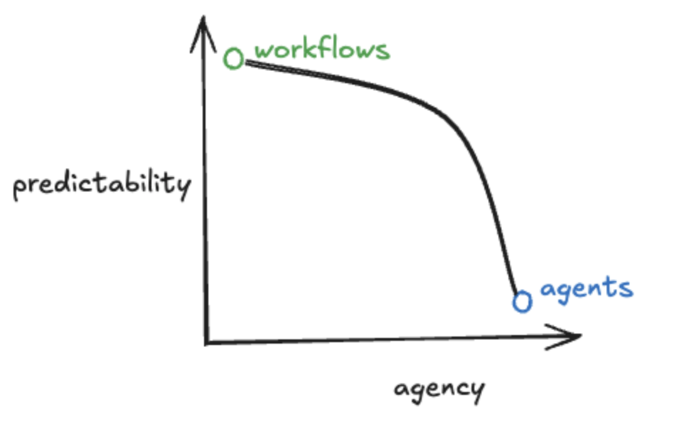
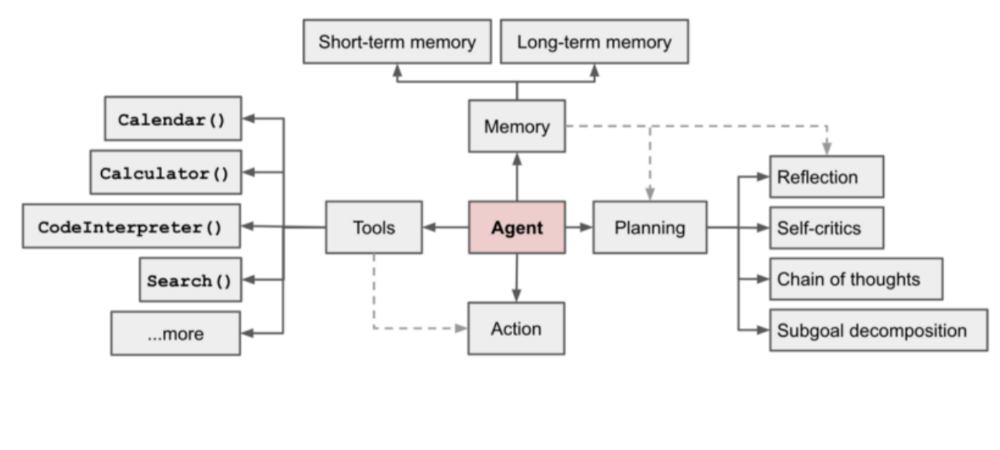

# Agent Primitives deep dive
---

`Agentic systems` are a combination of Agents and workflows, which means that it offers users with the capability to inject autonomous agent capabilities, as well as deterministic pre-defined code paths/workflows to have your systems have a good balance between **reliability** and ***agency***. It is important to think about agents in a non-binary manner, rather more in a continuous manner. The correct way to determine whether a system is an agent or not is by categorizing it on the level of reliability curve. View the image below:

  

## Pain point for Agent developers

Building agents in production is hard. It is important to test, evaluate, and make your agentic system/solution reliable. Most agent developers say that the hardest part about taking agentic solutions into production is ***performance quality*** as provided in the blog [here](https://blog.langchain.dev/how-to-think-about-agent-frameworks/). Making an agentic system reliable has several things that developers need to think through when building their solutions. Some of the pain points are as follows (as highlighted in the blog): 1/ **Either the model is not optimal for the use case, for which an optimal model should be selected through evaluation methods** or 2/**The data that the model is using at the step is either incomplete or incorrect**. Usually this happens because of the second reason. This means either passing in incomplete or short system messages, vague user inputs, function definitions, not having access to the right tools, etc. 

As mentioned in the blog: "***The hard part of building reliable agentic systems is making sure the LLM has the appropriate context at each step. This includes both controlling the exact content that goes into the LLM, as well as running the appropriate steps to generate relevant content.***"

## How agent primitives help solve for this and specifically LangGraph primitives?

You can think of agent primitives as foundational building blocks that can let you control, orchestrate, and compose every aspect of an Agent's behavior. This means the agent must have access to the right context and be able to call the right tool to provide the user with their domain specific/general ask/task. There are a couple of foundational and core primitives that agents offer that this lab will dive into such as **Memory, Human in the loop, Human on the loop, Observability, Multi agent patterns**, etc. 

By breaking down the agent primitives into these different parts, you can address the two biggest pain points for making your agentic systems reliable:

1. Choosing the optimal model for your agentic use case and

2. Supplying the correct and complete context to the agent at every step of that agent's action, by using the right memory, tools and other core aspects.

  

`LangGraph` is built for developers who want to build powerful, adaptable AI agents. Developers choose LangGraph for:

1. **Reliability and controllability**. Steer agent actions with moderation checks and human-in-the-loop approvals. LangGraph persists context for long-running workflows, keeping your agents on course.

2. **Low-level and extensible**. Build custom agents with fully descriptive, low-level primitives free from rigid abstractions that limit customization. Design scalable multi-agent systems, with each agent serving a specific role tailored to your use case.

3. **First-class streaming support**. With token-by-token streaming and streaming of intermediate steps, LangGraph gives users clear visibility into agent reasoning and actions as they unfold in real time.

In these samples, we will dive into different parts of each primitive and how you can use LangGraph to build reliable agentic systems effectively.

***To view the agent abstractions and primitives provided by LangGraph, view [here](https://langchain-ai.github.io/langgraph/agents/overview/?ref=blog.langchain.dev&_gl=1*iszxr6*_ga*MTc1MzY5ODE0OS4xNzM3MTQ5Mzgw*_ga_47WX3HKKY2*czE3NDcxNjEzNzkkbzI0JGcwJHQxNzQ3MTYxMzc5JGowJGwwJGgw#package-ecosystem).***

### Use Case

We will implement a project manager agent named `Maya`. This agent will be able to track marketing campaign deliverables. Over multiple sessions, this agent can add, view and update tasks without losing context. We will go over how we can use agentic primitives to build an effective agent that is accurate.

### Implementation details

View the implementation details and deep dive content on agent primitives in the folders below:

1. **[Memory](/memory)**: **Memory** is a cognitive function that helps people to store, retrieve and use information in their present and future. As agents take on complex tasks involving numerous user interactions, equipping them with memory becomes crucially important for efficiency and user satisfaction.