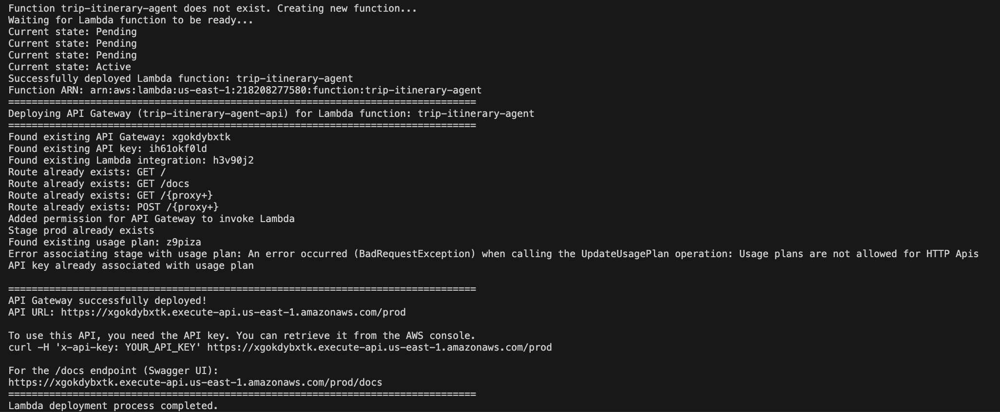
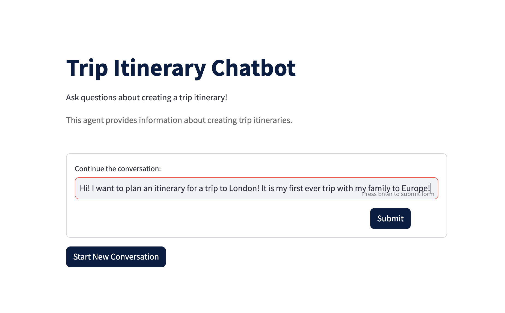
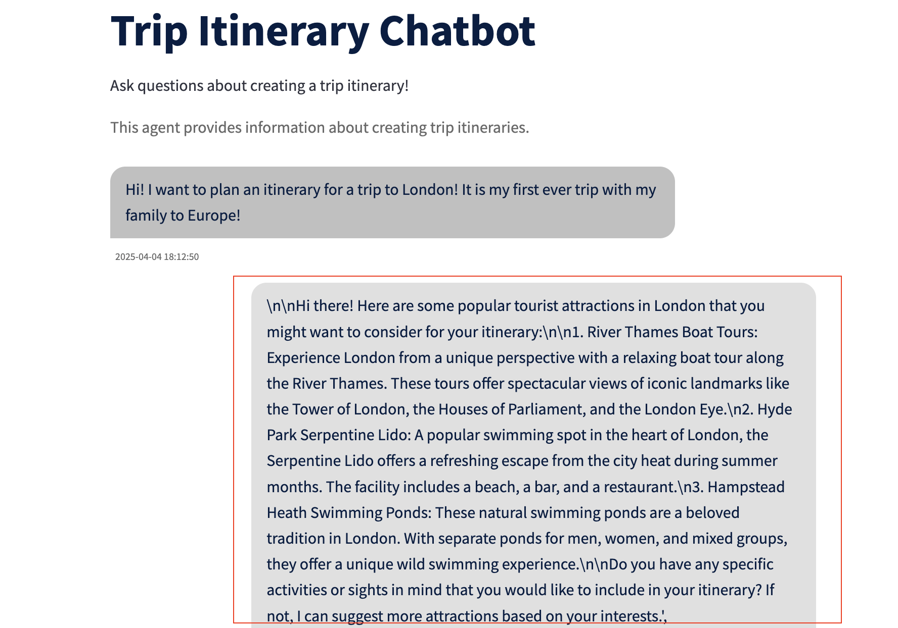

# Build-agents-with-LangGraph

### What is an Agent?

In context of Large Language Models (`LLMs`), an agent is an autonomous or semi-autonomous system that can take actions on behalf of the user in a given environment, state, and make decisions or take actions that can accomplish certain tasks. A more detailed explanation of agents would be systems powered by `LLMs`, or `LLMs` themselves that have access to a certain user environment, external sources (such as data) that they can use to accomplish user tasks by efficiently breaking the request into smaller components. An agent can perform these tasks using different components given below:

### Tools
Tools are simple functions (can be python functions) that agents use to interact with `APIs` or external data sources. Tools can be of various kinds but can be divided into two portions:

- `Built-in tools`: Several Agentic frameworks that help you build agents provide tools that are already implemented that you can use through your agent such as:
    1. Web search tools to retrieve information from the web (such as `DuckDuckGo`, `Bing Search`, `Wikipedia API`).
    1. Database tools such as `SQL Database connector` to execute SQL queries against relational databases.
    1. Different frameworks provide a host of different built-in tools. For example, view some built-in tools offered by `LangChain` [here](https://python.langchain.com/docs/concepts/tools/)

- `Custom tools`: You can build your own custom tools that perform various actions by interacting with your choice of custom/proprietary `APIs`. View some of these examples below:
    1. **Document parsing**: Extract and analyze text from PDF documents, create summaries of long documents, etc. 
    1. **Task management**: Create and assign tasks in project management systems for your specific use cases and customer stories.
    1. **Budget analyzer**: Categorize and analyze spending patterns across your company infrastructure using custom `APIs`.
    1. **Code analyzer**: Review code for bugs or improvements using your own fine-tuned model.

**Note**: Writing tools are simple as writing functions. You can write tools using different approaches via different frameworks. In this lab, we will go over how we can write tools in `LangGraph`.

### Workflows
Workflows are how agents can use a predefined sequence of operations that define how an agent can process information and take action. For example, a single agent can have access to multiple tools and be prompted to perform those actions either in a 

1. `sequential` manner (executing tools one by one), 
1. `branching`, where the agent dynamically determines which tool to call based on the step it took previously, 
1. `Cyclic`, where the agent can perform the same set of steps with a human in the loop to review and iterate on the new results or -
1. It can be a combination of various workflows and agents interacting all together.

### Persistence/Memory
Imagine if you had an agent powering your chatbot serving thousands of users. In that case, it becomes important to retain the memory and the state of the agent with specific user interactions. This is essential for:
1. Maintaining conversation context, 
1. Resuming interrupted operations
1. Tracking process across multiple user sessions.

### Human-in-the-loop (`HITL`)
Agents act autonomously and need to be evaluated. This requires iterative testing and a human, who can check the steps that an agent takes and makes sure that the agent is performing and executing the right steps and tools. For this, it is important to have a human-in-the-loop. 
- This workflow integrates a human input into automated processes, allowing for decisions.
- Useful in LLM-based applications to check for accuracy
- Examples of these are:
    1. **Reviewing tool calls**: Humans can review, edit or approve which tools to call by the agent.
    1. **Validating `LLM` outputs**: Humans can review, edit or approve the outputs generated by `LLMs`.
    1. **Providing context**: You can have the `agent` or `LLM` return control to the user. This means that the agent will pause and ask the human or user for validation before executing an action. (For example, asking for more information, or clarifying steps to take)

### Prompting
Prompting is a technique to control and provide instructions to how an `LLM` can process user inputs and generate responses. In Agentic systems, prompts are essential for:
1. **Defining the agent's role or capabilities**: Your agent solution might have several agents working together. In that case, having separate instructions and guidance for agents can be provided through prompts.
1. **Structuring the agent's thinking process**: Your agent's thinking process is defined by the instructions that you provide in the prompt. This includes if you want your agent to execute certain tools before the others for example.
    
**Note**: Prompt engineering is a separate topic and more information on this can be found [here](https://aws.amazon.com/what-is/prompt-engineering/). Prompt templates will be different from model-to-model to get the best performance for your agent use case.

### State management
State management in agents refer to tracking and updating the variables that the agent uses based on the conversation history, task progress, available resources and user preferences.

## Agent frameworks
There are several Agent frameworks that can help us build stateful, persistent agents. These frameworks are either open-source (Such as [LangGraph](https://www.langchain.com/langgraph), [LangChain](https://www.langchain.com/), [CrewAI](https://www.crewai.com/)) or AWS-offered, such as [Agents on Amazon Bedrock](https://aws.amazon.com/bedrock/agents/).

# Build a simple agent using `LangGraph`

In this lab, we will use `LangGraph` to build a simple agent. `LangGraph` is an open-source low-level orchestration framework for building controllable agents. This library enables agent orchestration, offering customizable architectures such as long-term memory, `HITL`, custom tools, etc. `LangGraph` provides low-level supporting infrastructure that sits underneath any workflow or agent. It does not abstract prompts or architecture, and provides three central benefits:

#### Persistence
`LangGraph` has a persistence layer, which offers a number of benefits:

1. `Memory`: LangGraph persists arbitrary aspects of your application's state, supporting memory of conversations and other updates within and across user interactions;
1. `Human-in-the-loop`: Because state is `checkpointed`, execution can be interrupted and resumed, allowing for decisions, validation, and corrections via human input.

#### Streaming
`LangGraph` also provides support for streaming workflow / agent state to the user (or developer) over the course of execution. `LangGraph` supports streaming of both events (such as feedback from a tool call) and tokens from LLM calls embedded in an application.

#### Debugging and Deployment
`LangGraph` provides an easy onramp for testing, debugging, and deploying applications via `LangGraph` Platform. This includes Studio, an IDE that enables visualization, interaction, and debugging of workflows or agents. This also includes numerous options for deployment.

## Prerequisites

## Installation Instructions
Follow these steps to set up and run the AWS incident response system:

1. Clone the repository

    ```bash
    git clone https://github.com/madhurprash/langGraph-AWS-incident-response.git
    cd langGraph-AWS-incident-response/scratchpad_examples
    ```

2. Install uv (a fast Python package installer), create and activate the Python environment and set up a Jupyter kernel for the environment

    ```bash
    curl -LsSf https://astral.sh/uv/install.sh | sh
    export PATH="$HOME/.local/bin:$PATH"
    uv venv && source .venv/bin/activate && uv pip sync pyproject.toml
    UV_PROJECT_ENVIRONMENT=.venv
    uv add zmq
    python -m ipykernel install --user --name=.venv --display-name="Python (uv env langGraph workshop)"
    ```

Next, navigate to the labs below and run the Jupyter notebooks after selecting the python environment `LangGraph AWS workshop` as the kernel in the Jupyter notebook.

## Notebooks to run

1. [0_build_simple_single_agent_langgraph.ipynb](0_build_simple_agent_langGraph/0_build_simple_single_agent_langgraph.ipynb): This notebook shows how to build a simple agent using `LangGraph`. This agent can take user input and generate a response using `LLMs` and tools. This notebook uses models on Bedrock as the LLM (using the `ChatBedrockConverse` API) and generates a response based on the user question. This example also shows how to configure short term and long term memory for the agent. The agent can also use tools to generate a response.

2. [1_add_tools_to_simple_agent.ipynb](1_add_tools_to_agent/1_add_tools_to_simple_agent.ipynb): This notebook shows how to add tools to the agent. The agent can use these tools to generate a response based on the user question.

3. [2_advance-langgraph-multi-agent-setup.ipynb](2_multi_agent_langGraph/2_advance-langgraph-multi-agent-setup.ipynb2_advance-langgraph-multi-agent-setup.ipynb): This notebook builds a multi agent system using LangGraph using a flight sub agent and a hotel sub agent. This notebook also shows how to use human in the loop to validate the response generated by the agent.

4. [3_deploy_langGraph_agent](3_deploy_langGraph_agent): This folder contains the code to deploy the agent using `LangGraph` platform. This includes the code to deploy the agent using `AWS Lambda` and `AWS API Gateway`. The code is in the `server.py` file. The `deploy.sh` script can be used to deploy the agent. The `deploy.sh` script will create a new Lambda function and API Gateway for the agent. Enter the commands below to deploy the agent:

    #### Deploy the agent using `FastAPI` and `AWS Lambda`

    1. Make sure you have the virtual environment activated. Run the command below to deploy the agent. This command runs the `build_and_push.sh` script to build the docker image and push it to `Amazon Elastic Container Registry (ECR)`. Next, it creates a new Lambda function using the container image. It also creates an HTTP API (API Gateway v2) to invoke the Lambda function. The API Gateway URL is printed at the end of the script. This command also creates an API key for securing the API with a usage plan.

    ```bash
    python deploy.py --function-name <name-of-your-lambda-function> --role-arn <your-iam-role-name> --api-gateway
    ```

    The IAM role you need to use for the AWS Lambda needs to have Amazon Bedrock access (for example via [AmazonBedrockFullAccess](https://docs.aws.amazon.com/aws-managed-policy/latest/reference/AmazonBedrockFullAccess.html)) to use the models available via Amazon Bedrock and the models need to be enabled within your AWS account, see instructions available [here](https://docs.aws.amazon.com/bedrock/latest/userguide/model-access.html).

    You should see the following output:

    

    2. You can test the API using `curl` or `Postman`. The API Gateway URL is printed at the end of the script. You can use this URL to test the API. The API key is also printed at the end of the script. You can use this API key to test the API.

    ```bash
    curl -X POST -H "Content-Type: application/json" -d '{"user_message":"Plan a trip to Paris"}' https://<YOUR-API-KEY>.execute-api.us-east-1.amazonaws.com/prod/generate-itinerary
    ```

    3. **Launch the streamlit app**: Run the command below to launch the streamlit app. This app will use the API Gateway URL to generate a response using the agent. The app will also show the response generated by the LangGraph agent.

    ```bash
    streamlit run chatbot.py -- --api-server-url https://<YOUR-API-KEY>.execute-api.us-east-1.amazonaws.com/prod/generate-itinerary
    ```

    ***Now, you can interact with the agent using the streamlit app. The app will show the response generated by the agent. You can also see the logs of the agent in the terminal.***

    
    
    

5. **Introduction to Model Context Protocol (MCP)**: In this file, we are going to introduce the concept of Model Context Protocol (MCP), how it helps agents/LLMs to easily get access to data sources using a standardized protocol, and how you can easily build your MCP agent solutions using `LangGraph` and `Bedrock`.


